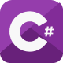
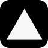

# 😊 About Me:

😊 _**Hello, I'm Murad. My first introduction to the software world started in 2017 by developing simple Discord bots. This process made me realize my interest in software. However, at that time, I had difficulty in progressing due to lack of technical knowledge and took a break for a while and turned to the world of design. I developed myself especially in the field of graphic design and revealed my creativity in projects as a professional graphic designer in the field of graphic design. In 2020, although I was working as a graphic designer, I tried to enter the software world, but this time I was insufficient in some subjects, I gave up again due to lack of information, and it was even more difficult because I was working in the design field at that time.**_ 

_**In 2023, my passion for software prevailed and I took a professional step and trained as a Full-Stack C# developer. Since then, I have been developing websites and web applications using modern technologies. Especially React and Next.js are among the technologies I use and enjoy the most in my projects.**_ 

_**As a full-stack developer, I am constantly learning and improving myself. In addition, I have a great interest in cyber security and I aim to gain competence in this field.**_ 

_**I am a developer and technology enthusiast with a passion for software development and cybersecurity, open to innovation, and love to learn.**_

  

# 🌐 Socials:

# 💻 Software tech:

  
 
 
 
 
 
 
 
 
 
 

 

 

 
  

# 🌱 Technologies I will learn:

 

  

# 📊 GitHub Stats:

---

<!--  
 
 

# 🌿 What I know little about:

-->

